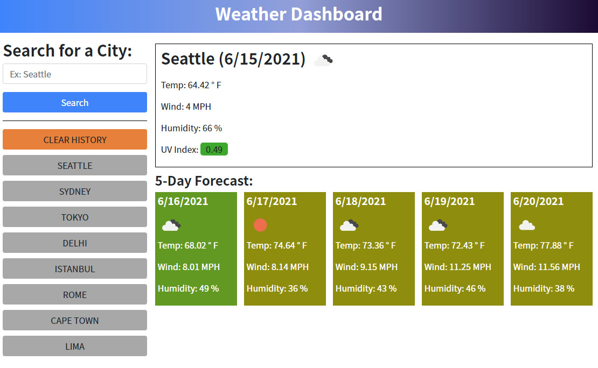

# Weather Forecast Dashboard

[](https://opensource.org/licenses/MIT)

## Description
This web application was designed as a quick way to look up the current and five day weather forecast for various cities around the world and compare the results between past city searches. The 3rd party API used for the weather data comes from OpenWeather. The UV index and forecast background colors are presented in response to the data so that the user on a glimpse can see how intense the UV light is and if the week will be cold or hot. The app is also responsive to multiple screen sizes and for mobile display. The search history is persistent as local data so the user can return to the webpage and quickly revisit past inquiries. Google Fonts, Bootstrap, jQuery, and Moment.js were also used in the project.

## Table of Contents

- [User Story](#user-story)
- [Live Site](#live-site)
- [Technologies](#technologies)
- [Future Development](#future-development)
- [License](#license)
- [Contributing](#contributing)
- [Contact](#contact)

## User Story
```
AS A traveler
I WANT to see the weather outlook for multiple cities
SO THAT I can plan a trip accordingly
```

## Live Site

https://williamcrownover.github.io/weather-forecast-dashboard/



## Technologies
- OpenWeather API
- Bootstrap
- jQuery
- Moment.js

## Future Development
I will be revisiting this project in the future to expand upon the interactivity of the website and refine the overall graphic design/layout.

## License
Licensed under the MIT License - https://opensource.org/licenses/MIT

## Contributing
You are welcome to fork this repo or make contributions to the project in collaboration with me.

## Contact

If you have any questions you can email me at williamcrownover1@gmail.com.


You can also check out my other work on GitHub at [WilliamCrownover](https://github.com/WilliamCrownover)
